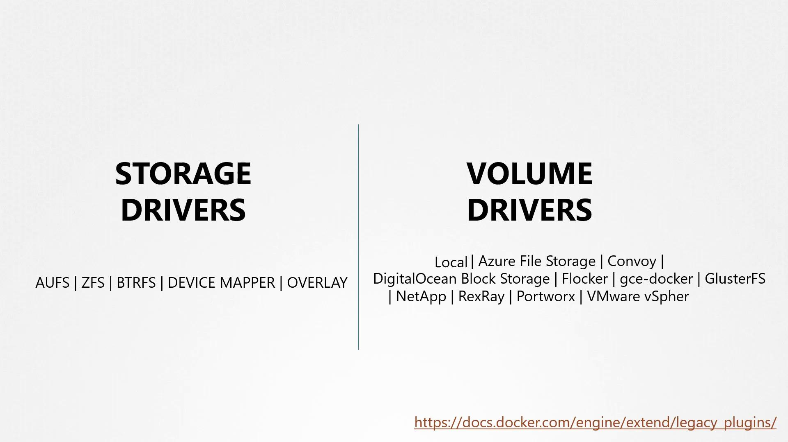

# Volumes

## Review of docker volume
Volume mounts:
```shell
docker volume create data_volume
docker run -v data_volume:/var/lib/mysql mysql
```

Anonymous volume mounts:
```shell
docker run -v data_volume2:/var/lib/mysql mysql
```

Bind mounts:
```shell
docker run -v /data/mysql:/var/lib/mysql mysql
```

Use --mount options.
```shell
docker run \
  --mount type=bind,source=/data/mysql,target=/var/lib/mysql \
  mysql
```

Note that how it mapped to hardware is controlled by volume driver (default local). Examples:


## CSI (Container Storage Interface)
- CRI Container Runtime interface
- CSI Container Storage interface
- CNI Container Network interface
- CPI Cloud provider interface
- SMI Service Mesh Interface
- OCI Open Container Initiative

## Volumes
Kubernetes pods are ephemeral by design. When a pod processes data and is subsequently deleted, the data inside it is 
normally lost. To retain this data, a volume is attached to the pod. Any data generated by the pod is stored in the 
volume and remains available even after the pod is terminated.

E.g. Host Path Volume
```yaml
apiVersion: v1
kind: Pod
metadata:
  name: random-number-generator
spec:
  containers:
  - image: alpine
    name: alpine
    command: ["/bin/sh", "-c"]
    args: ["shuf -i 0-100 -n 1 >> /opt/number.out;"]
    volumeMounts:
    - mountPath: /opt
      name: data-volume
  volumes:
  - name: data-volume
    hostPath:
      path: /data
      type: Directory
```
However, this is not optimal for multiple node case, some options in that case are:
- NFS
- GlusterFS
- Flocker
- Fibre Channel
- CephFS
- ScaleIO
- Public cloud storage solutions like AWS EBS, Azure Disk or File, and Google Persistent Disk

| Storage Option | Use Case | Example Configuration |
|---|---|---|
| hostPath | Single-node clusters | Uses local directory |
| AWS EBS | Multi-node clusters on AWS | awsElasticBlockStore |
| Azure Disk | Multi-node clusters on Azure | azureDisk |
| Google Persistent Disk | Multi-node clusters on Google Cloud | gcePersistentDisk |
| NFS | Shared storage across nodes | NFS volume configuration |

E.g. Check: `kubectl explain pod.spec.volumes.awsElasticBlockStore`

## PV/PVC
In environments where many users deploy multiple pods, duplicating storage configuration in every pod file can lead to 
redundancy and increased maintenance efforts. Any required change would need to be propagated across all pod definitions.

To solve this issue, administrators can create a centralized pool of storage. Users then request portions of this 
storage as needed by creating persistent volume claims (PVCs). This concept is enabled by persistent volumes (PVs).

A persistent volume is a cluster-wide storage resource defined and managed by an administrator. Applications running 
on the cluster utilize these PVs by binding to them via persistent volume claims.

Yaml example: https://kubernetes.io/docs/tasks/configure-pod-container/configure-persistent-volume-storage/
```yaml
apiVersion: v1
kind: PersistentVolume
metadata:
  name: pv-vol1
spec:
  accessModes:
    - [ReadWriteOnce|ReadWriteMany|ReadOnlyMany]
  capacity:
    storage: 1Gi
  hostPath:
    path: /tmp/data
```

After that, we can make a claim to claim the volume.
Persistent volumes and persistent volume claims are two distinct objects in Kubernetes. An administrator is responsible 
for creating PVs, while users create PVCs to request storage resources. When a PVC is created, Kubernetes automatically 
binds it to a PV that meets the requested capacity, access modes, volume modes, and storage class.

It is important to note that if a smaller PVC is matched with a larger PV that meets all criteria, the unrequested 
capacity remains unused by any other PVC. If no PV satisfies the claim’s requirements, the PVC will remain in a pending 
state until a new, suitable PV becomes available.

Yaml: https://kubernetes.io/docs/concepts/storage/persistent-volumes/
```yaml
apiVersion: v1
kind: PersistentVolumeClaim
metadata:
  name: myclaim
spec:
  accessModes:
    - ReadWriteOnce
  resources:
    requests:
      storage: 500Mi
```

When a PVC is deleted, what happens next depends on the underlying persistent volume's reclaim policy. The reclaim policy determines the fate of the PV and can be configured as follows:

| Policy | Description |
|---|---|
| Retain | The PV remains in the cluster after the PVC is deleted. An administrator must manually reclaim it. |
| Delete | The PV is automatically deleted along with the PVC, releasing the storage on the physical device. |
| Recycle | The PV data is scrubbed before reuse by new claims. |

PVC can then be attached to Pod/RS/Deployment like:
```yaml
apiVersion: v1
kind: Pod
metadata:
  name: mypod
spec:
  containers:
    - name: myfrontend
      image: nginx
      volumeMounts:
      - mountPath: "/var/www/html"
        name: mypd
  volumes:
    - name: mypd
      persistentVolumeClaim:
        claimName: myclaim
```

A deployment/rs can also refer to a PVC, in this case, all pods within the deployment are referring to the same volume. 
In the case of restful set, each pod get a new pvc.

## StorageClass
The PV/PVC method has a drawback that we have to manually create the PV everytime, not scalable. We can do it via storage class:
https://kubernetes.io/docs/concepts/storage/storage-classes/
Where we provide:
- provisioner
- any additional parameter

And then in the PVC, we can just link the storage class, the underlying provisioner can then create a pv for us and bind correspondingly, nothing else changed.
```yaml
apiVersion: v1
kind: PersistentVolumeClaim
metadata:
  name: myclaim
spec:
  accessModes:
    - ReadWriteOnce
  storageClassName: google-storage
  resources:
    requests:
      storage: 500Mi
```