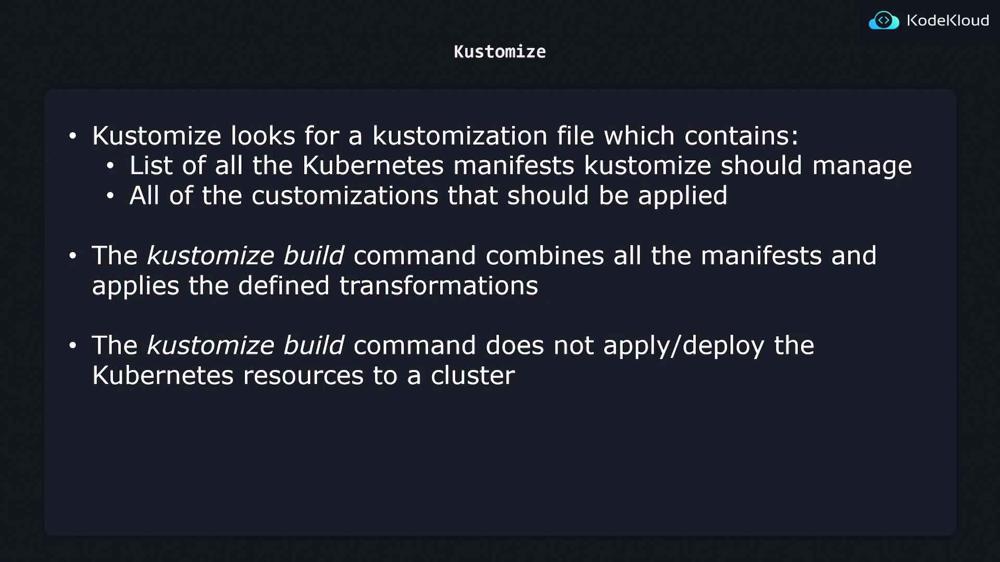

# Kustomize
The issue kustomize is trying to solve is in case u have same set of yaml files and you want to push/deploy it to different
flavor, then we do not want the same copy of yaml for different environment.

Instead, we want some structure like this:
```yaml
k8s/
├── base/
│   ├── kustomization.yaml
│   ├── nginx-depl.yaml
│   ├── service.yaml
│   └── redis-depl.yaml
└── overlays/
    ├── dev/
    │   ├── kustomization.yaml
    │   └── config-map.yaml
    ├── stg/
    │   ├── kustomization.yaml
    │   └── config-map.yaml
    └── prod/
        ├── kustomization.yaml
        └── config-map.yaml
```
So we only need to include extra files (not only kustomization, can be any values), in a separate folder.

Kustomize takes the Base configuration and the overlays to produce a final, environment-specific Kubernetes manifest 
that you can apply to your cluster. One major benefit is that Kustomize is built into kubectl, eliminating the need 
for additional installation (though you can opt to install a newer version if desired).

Note that helm can do similar by store all values in a directory, and when apply just specify a value directory. Helm is better
at repo/code management, while its template file is not too user-friendly.

## Install
Its something already come with kubectl: https://kubernetes.io/docs/tasks/manage-kubernetes-objects/kustomization

## kustomization file
```yaml
apiVersion: kustomize.config.k8s.io/v1beta1
kind: Kustomization

# Kubernetes resources to be managed by Kustomize
resources:
  - nginx-deployment.yaml
  - nginx-service.yaml

# Customizations to be applied to all resources
commonLabels:
  company: KodeKloud
```

Here's an example of kustomization file, at here, when we apply the file, it will does two things:
1. Get all files defined in the resource section
2. add label `company: KodeKloud` to all resources
Then `kustomize build k8s/` the final result yaml files will be outputted to shell, and we can `kustomize build k8s/ | kubectl apply -f -` to pipe that into apply. For kubectl, the command can be simplified into: `kubectl apply -k k8s/`


## Managing Directories
Here, we only look at `resources`

One way is that we can have everything as a relative path to the root `kustomization.yaml`. E.g.
```yaml
resources:
  - api/api-depl.yaml
  - api/api-service.yaml
  - db/db-depl.yaml
  - db/db-service.yaml
```

Or we can have a sub `kustomization` in each folder, and a `kustomization` referring to them as directory.
```yaml
resources:
  - api/
  - db/
  - cache/
  - kafka/
```

## Transformers
Transformers means we can share some common annotations or labels or image transformers in kustomization.yaml file. This will be 
applied to every yaml file under the scope. Local kustomization file have higher priority than global kustomization file if they
both specify transformation of same kind.

- `commonLabels` give common labels to all resource under the scope
- `commonAnnotations` give common annotations to all resource under the scope
- `namePrefix/nameSuffix` give prefix/suffix to all resources's name
- `namespace` to give common namespace

Also can transform images:

```yaml
images:
  - name: nginx
    newName: haproxy
    newTag: 1.12.0
```
To replace old image with new image. Kustomize will replace the image only if the image name exactly matches "nginx".

## Patches
`patches` allow we specify more specific change of something, in includes the following components
- Operation Type: This parameter defines the type of change to perform. The primary operations include:
  - add: Adds an element to a list (e.g., adding a container to a Deployment’s container list).
    - remove: Deletes an element from the configuration (e.g., removing a container or label).
    - replace: Substitutes an existing value with a new one (e.g., updating a Deployment's replica count from 5 to 10).
- Target:
  - The target parameter specifies which Kubernetes resource or resources will be patched. You can match resources based on properties such as kind, version, name, namespace, label selectors, or annotation selectors. Multiple properties can be combined to precisely target the intended objects.
- Value:
  - For add or replace operations, this parameter defines the value to be added or used as a replacement. The remove operation does not require a value since it deletes the specified element.

```yaml
patches:
  - target:
      kind: Deployment
      name: api-deployment
    patch: |-
      - op: replace
        path: /metadata/name
        value: web-deployment
```
For example, the following patches target at specific deployment, and will replace the metadata/name to certain value

```yaml
patches:
- target:
    kind: Deployment
    name: api-deployment
  patch: |-
    - op: replace
      path: /spec/replicas
      value: 5
```
Another example to replace replicas.

It also has stragetic type, which basically means write the target in the format of normal yaml file of k8s.

Here's an example of strategic patches
```yaml
patches: |
  - patch: |-
      apiVersion: apps/v1
      kind: Deployment
      metadata:
        name: api-deployment
      spec:
        replicas: 5
```

Note that the path is actually like the path in `kubectl explain`, that is a dictionary type to refer to some components

For list of objects, we refer to x-th element by:
```yaml
patches:
  - target:
      kind: Deployment
      name: api-deployment
    patch: |-
      - op: replace
        path: /spec/template/spec/containers/0
        value:
          name: haproxy
          image: haproxy
```
For add, the following one will add to the end, otherwise it works like insert where we specify an index.
```yaml
patches:
  - target:
      kind: Deployment
      name: api-deployment
    patch: |-
      - op: add
        path: /spec/template/spec/containers/-
        value:
          name: haproxy
          image: haproxy
```

## Overlay
So in overlay mode, we combine everything together, what we do is we add base files in base folder, and use patches in kustomization
file to assign different values to different components, we only need to specify base path like:
```yaml
bases:
  - ../../base
patch: |-
  - op: replace
    path: /spec/replicas
    value: 2
```

## Components
Sometime we want to create some elements that are:
- shared by some flavor
- not shared by all flavor

In this case, we want to create it as components and import within flavor files.

```yaml
k8s/
├── base/
│   ├── kustomization.yaml
│   └── api-depl.yaml
├── components/
│   ├── caching/
│   │   ├── kustomization.yaml
│   │   ├── deployment-patch.yaml
│   │   └── redis-depl.yaml
│   └── db/
│       ├── kustomization.yaml
│       ├── deployment-patch.yaml
│       └── postgres-depl.yaml
└── overlays/
    ├── dev/
    │   └── kustomization.yaml
    ├── premium/
    │   └── kustomization.yaml
    └── standalone/
        └── kustomization.yaml
```

In this setup:
- Base contains shared configurations.
- Overlays (dev, premium, standalone) inherit from the Base.
- Components store isolated configurations for individual features, such as caching and external database (db). Each component directory includes all the necessary Kubernetes resources to enable the feature.

The kustomization file within components should look like:
```yaml
apiVersion: kustomize.config.k8s.io/v1alpha1
kind: Component
resources:
  - postgres-depl.yaml
secretGenerator:
  - name: postgres-cred
    literals:
      - password=postgres123
patches:
  - deployment-patch.yaml
```

And we can just import it like:

```yaml
bases:
  - ../../base
components:
  - ../../components/db
```