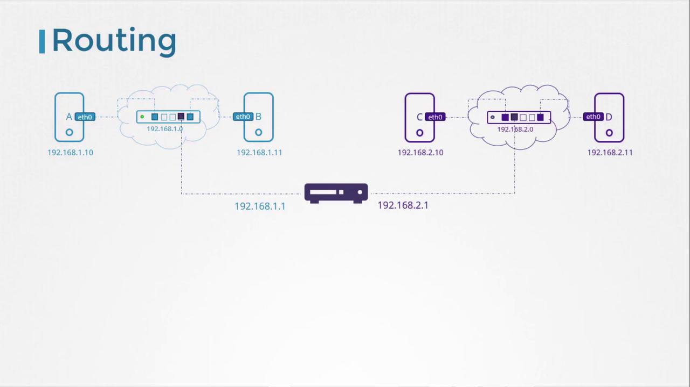
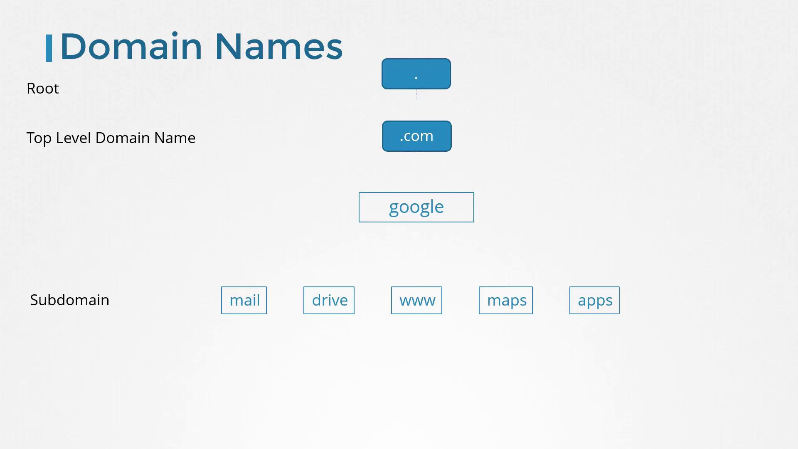
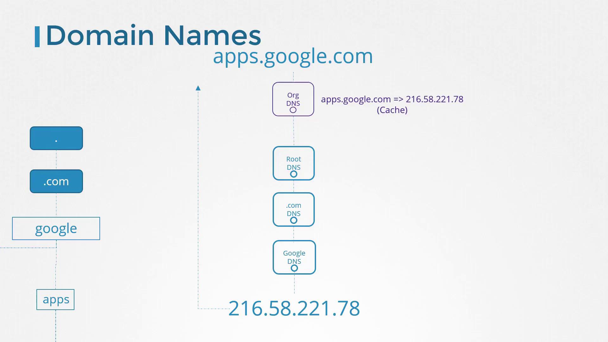
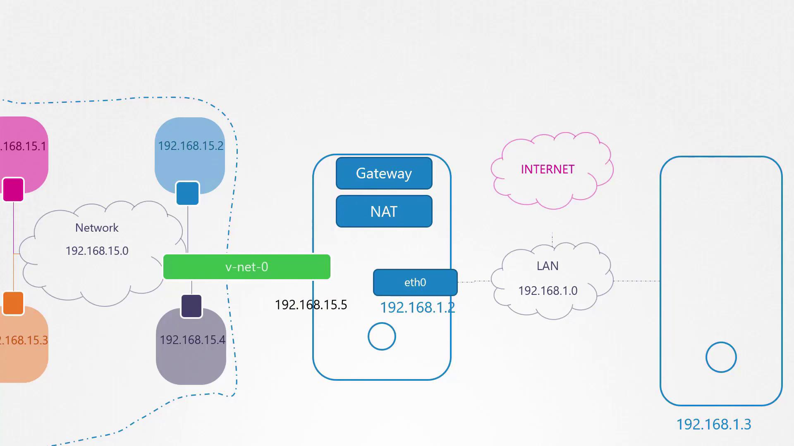
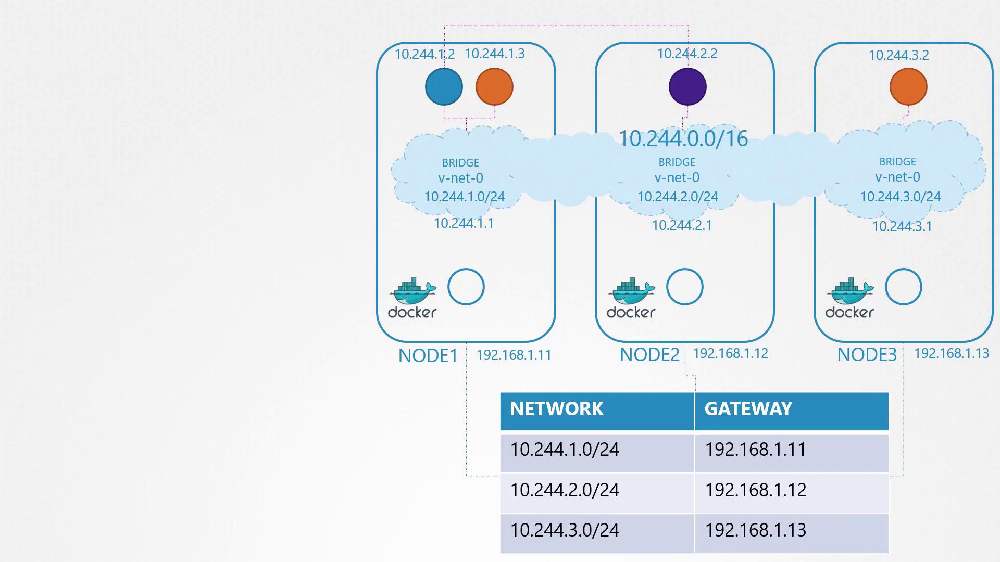
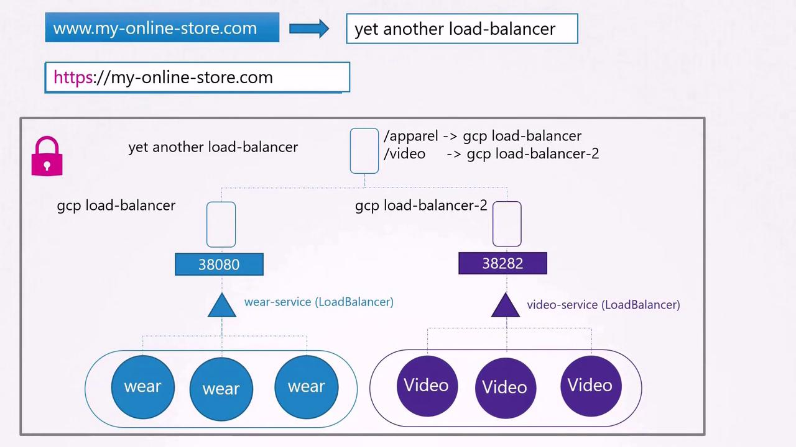
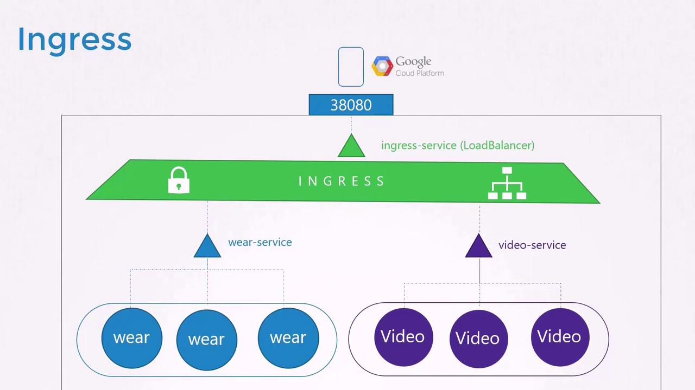

# Network

## Switch Routing
### What is a Network Interface?
A network interface is essentially the point of connection between a computer and a network. It's the hardware 
(or virtual equivalent) that allows a device to send and receive data over a network. Think of it as the "door" through 
which your computer communicates with the outside network world.

- Hardware (Physical) Interfaces:
  - These are physical network adapters, like Ethernet cards (e.g., eth0), Wi-Fi adapters (e.g., wlan0), or fiber optic adapters.
  - They translate digital data from your computer into signals that can be transmitted over the network medium (e.g., electrical signals over Ethernet cables, radio waves for Wi-Fi, light pulses for fiber).
- Virtual Interfaces:
  - These are software-defined interfaces, often used in virtual machines (VMs), containers, or for creating virtual private networks (VPNs).
  - They allow virtualized systems to communicate with each other or with the physical network. Examples include veth pairs (used in Docker and other container technologies), tun and tap interfaces (used in VPNs), and lo (loopback interface).

### Add network address to network interface
`ip addr add 192.168.1.10/24 dev eth0`

192.168.1.10/24 means first 24 bits is for public network address, last 8 bits is to identify devices on this machine. (This is done by bitwise operation AND to get IP address).
So 192.168.1.0 is the ip address, .10 is the identifier for the machine. First IP within range is for gateway, last IP within range is for broadcast.
- Gateway: 192.168.1.0 -> the IP of router itself
- Broadcast: 192.168.1.255 -> the message to this channel will get to everyone in the subnet

`ip addr add 192.168.1.10/24 dev eth0` (dev stands for device) basically says:
- "If traffic is coming to 192.168.1.10, receive it through eth0."
- "If traffic is going from 192.168.1.10, send it through eth0."

- 192.168.1.10 is a private IP address. This means it's only valid within your local network. Computers on the internet cannot directly connect to it.
- To make your machine accessible from the internet, you need:
  - A public IP address: Your internet service provider (ISP) assigns this to your router.
  - Port forwarding: You need to configure your router to forward traffic from a specific port on your public IP address to the 192.168.1.10 IP address and the port your service is listening on.
  - Dynamic DNS (Optional): If your public IP address changes frequently (which is common for home internet connections), you can use a dynamic DNS service to associate a domain name with your IP address.
  - Registering: You do not register 192.168.1.10 anywhere on the internet. That's because it's a private IP. You would register a domain name with a domain registrar, and then that domain name would be pointed to your public IP.

### Routing Between Subnets
Now, consider a second network, such as 192.168.2.0, with hosts assigned IPs like 192.168.2.10 and 192.168.2.11. 
For communication between these two networks, a router is necessary.

A router interconnects two or more networks and holds an IP address in each network—e.g., 192.168.1.1 for the first 
network and 192.168.2.1 for the second. When a system on network 192.168.1.0 (say, with IP 192.168.1.11) needs to 
communicate with a system on network 192.168.2.0, it forwards packets to the router.


Each system must be configured with a gateway or specific route entries to ensure that packets reach the intended destination. To view the current routing table, use: `route`
Then: `ip route add 192.168.2.0/24 via 192.168.1.1`.

```bash
route
Kernel IP routing table
Destination     Gateway         Genmask         Flags Metric Ref    Use Iface
192.168.2.0     192.168.1.1     255.255.255.0   UG    0      0        0 eth0
```

This means that for whatever request to 192.168.2.0/24, we send to 192.168.1.1, and the device at 192.168.1.1 will help us
send to 192.168.2.0/24. If a return route is required (for instance, for a host in network 192.168.2.0 to reach a host 
in 192.168.1.0), add the appropriate route on that system using its corresponding gateway (e.g., 192.168.2.1).

### Configuring Default Routes for Internet Access
To enable internet access (such as reaching external hosts like 172.217.194.0), configure the router as the default gateway. This is done by adding a default route:
`ip route add default via 192.168.2.1`.

This means, for whatever request send to IPs outside current subnet, or anything else in the routing table, try public net.

```bash
route
Kernel IP routing table
Destination     Gateway         Genmask         Flags Metric Ref    Use Iface
192.168.1.0     192.168.2.1     255.255.255.0   UG    0      0        0 eth0
172.217.194.0   192.168.2.1     255.255.255.0   UG    0      0        0 eth0
default         192.168.2.1     0.0.0.0         UG    0      0        0 eth0
```

### Multiple Router
For scenarios involving multiple routers—such as one handling internet traffic and another managing internal 
networks—ensure each network has its specific routing entry along with a default route for all other traffic. 
For example, to route traffic to network 192.168.1.0 via an alternative gateway (192.168.2.2), use:
`ip route add 192.168.1.0/24 via 192.168.2.2`.

```bash
route
Kernel IP routing table
Destination     Gateway         Genmask         Flags Metric Ref    Use Iface
default         192.168.2.1     0.0.0.0         UG    0      0        0 eth0
192.168.1.0     192.168.2.2     255.255.255.0   UG    0      0        0 eth0
```

### Configuring a Linux Host as a Router
Consider a scenario with three hosts (A, B, and C) where host B connects to two subnets (192.168.1.x and 192.168.2.x) using two interfaces. For example:
- Host A: 192.168.1.5
- Host B: 192.168.1.6 and 192.168.2.6
- Host C: 192.168.2.5

For host A to communicate with host C, host A must direct traffic aimed at network 192.168.2.0 to host B. On host A, execute:
- `ip route add 192.168.2.0/24 via 192.168.1.6`

Similarly, host C needs a route for the 192.168.1.0 network via host B (using 192.168.2.6 as the gateway):
- `ip route add 192.168.1.0/24 via 192.168.2.6`

Even with the correct routing table, Linux does not forward packets between interfaces by default, as a security measure. This setting is controlled by the IP forwarding parameter in /proc/sys/net/ipv4/ip_forward.

`echo 1 > /proc/sys/net/ipv4/ip_forward`

To ensure this setting persists across reboots, modify /etc/sysctl.conf and add or update the following line:
`net.ipv4.ip_forward = 1`

Operation|Command Example
---|---
List network interfaces|`ip link`
View assigned IP addresses|`ip addr`
Assign an IP address|`ip addr add 192.168.1.10/24 dev eth0`
View the routing table|`route`
Add a specific route|`ip route add 192.168.1.0/24 via 192.168.2.1`
Set a default gateway|`ip route add default via 192.168.2.1`
Check IP forwarding status|`cat /proc/sys/net/ipv4/ip_forward`
Enable IP forwarding temporarily|`echo 1 > /proc/sys/net/ipv4/ip_forward`

## DNS
DNS automatically redirect network operation from string to IP to make it more human readable.
```shell
cat >> /etc/hosts
192.168.1.11    db
```
This is the local place where DNS get stored. You can even create multiple aliases for a single IP address. For instance, 
you might convince Computer A that Computer B is also known as "www.google.com":

```shell
cat >> /etc/hosts
192.168.1.11    db
192.168.1.11    www.google.com

ping db
PING db (192.168.1.11) 56(84) bytes of data.
64 bytes from db (192.168.1.11): icmp_seq=1 ttl=64 time=0.052 ms
64 bytes from db (192.168.1.11): icmp_seq=2 ttl=64 time=0.079 ms

ping www.google.com
PING www.google.com (192.168.1.11) 56(84) bytes of data.
64 bytes from www.google.com (192.168.1.11): icmp_seq=1 ttl=64 time=0.052 ms
64 bytes from www.google.com (192.168.1.11): icmp_seq=2 ttl=64 time=0.079 ms
```


Every time you reference a host by name—whether by ping, SSH, or curl—the system consults the /etc/hosts file for IP address mapping. This process is called name resolution.

### DNS Server
While managing local /etc/hosts files works for small networks, it becomes difficult to maintain as the number of systems grows and IP addresses change.

To overcome the challenges of managing numerous local host mappings, organizations consolidate all mappings on a 
centralized DNS server. Suppose your centralized DNS server is at IP address 192.168.1.100. You configure each host to 
use this server by editing the `/etc/resolv.conf` file:
```shell
cat /etc/resolv.conf
nameserver 192.168.1.100
```
Once configured, any hostname that is not found in /etc/hosts is resolved via the DNS server. If an IP address changes, 
you update the DNS server's records instead of modifying each system individually. Although local /etc/hosts 
entries—which are useful for test servers—are still honored, they take precedence over DNS queries. 
The resolution order is defined in `/etc/nsswitch.conf`:
```shell
cat /etc/nsswitch.conf
...
hosts:          files dns
...
```
In this configuration, the system first searches the /etc/hosts file for a hostname. If a match is not found, it then queries the DNS server.
To resolve external domains like Facebook, add a public DNS server (for example, Google's 8.8.8.8) or configure your 
internal DNS server to forward unresolved queries to a public DNS resolver.

### Domain Names and Structure
Up until now, we have been resolving internal hostnames such as web, db, and nfs. But what is a domain name? A domain name (like www.facebook.com) is composed of parts separated by dots:

• The top-level domain (TLD) appears at the end (e.g., .com, .net, .edu, .org).
• The domain name precedes the TLD (e.g., facebook in www.facebook.com).
• Any segment before the domain name is considered a subdomain (e.g., www).

For instance, consider Google's domain: • The root is implicit.
• ".com" is the TLD.
• "google" is the main domain.
• "www" is a subdomain.

Subdomains allow organizations to separate services. Examples from Google include maps.google.com for maps, drive.google.com for storage, and mail.google.com for email.

When your organization attempts to access a domain like apps.google.com, the internal DNS server first tries to resolve 
the name. Failing that, it forwards the request through a hierarchical process: a root DNS server directs it to a .com 
DNS server, which then points to Google's DNS server. The IP address is returned and cached temporarily to expedite future queries.


### Using Search Domains for Short Names
Within many organizations, it is often convenient to use short hostnames. To resolve a short name (for example, "web") 
to its fully qualified domain name (FQDN, such as web.mycompany.com), add a search domain to your `/etc/resolv.conf` file:
```shell
cat >> /etc/resolv.conf
nameserver 192.168.1.100
search mycompany.com

ping web
PING web (192.168.1.10) 56(84) bytes of data.
64 bytes from web (192.168.1.10): icmp_seq=1 ttl=64 time=0.052 ms
64 bytes from web (192.168.1.10): icmp_seq=2 ttl=64 time=0.079 ms
```

You can also specify multiple search domains. In the following example, the system will sequentially append each provided domain until a match is found:
```shell
cat >> /etc/resolv.conf
nameserver 192.168.1.100
search mycompany.com prod.mycompany.com
```

### Overview of Common DNS Record Types
Record Type|Hostname|Address/Mapping|Description
---|---|---|---
A|web-server|IPv4 address (e.g., 192.168.1.1)|Maps hostname to an IPv4 address
AAAA|web-server|IPv6 address (e.g., 2001:0db8:85a3:0000:0000:8a2e:0370:7334)|Maps hostname to an IPv6 address
CNAME|food.web-server|eat.web-server or hungry.web-server|Aliases one hostname to another

One Option for K8S is CoreDNS: https://www.udemy.com/course/certified-kubernetes-administrator-with-practice-tests/learn/lecture/14410330#content

## Prerequisite Network Namespaces
When a container is created, it is placed in its own network namespace. Inside this namespace, the container only sees 
its own processes.

However, listing processes on the host as root shows all processes running on the system—including those inside containers.

This is same for network namespaces.
- `ip link` get all network devices on host
- `ip netns exec red ip link` or `ip -n red link`: Give network devices on a specific namespace

To connect namespaces, you create virtual Ethernet (veth) pairs that act like cables between two entities.
- `ip link add veth-red type veth peer name veth-blue` Create a cable, two side with name `veth-red` `veth-blue`
- `ip link set veth-red netns red && ip link set veth-blue netns blue` Assign each device to the namespace
- `ip -n red addr add 192.168.15.1/24 dev veth-red && ip -n blue addr add 192.168.15.2/24 dev veth-blue` Inside ns, connect request to those IPs to that device (virtual).
- `ip -n red link set veth-red up && ip -n blue link set veth-blue up` turn it up from both side

When working with more than two namespaces, linking every pair using veth pairs is impractical. Instead, establish a 
virtual network switch (or bridge) on the host to interconnect all namespaces. Linux offers tools such as the native Linux bridge or Open vSwitch.
In this example, a Linux bridge is created:
- Create a new bridge interface (named v-net-0): `ip link add v-net-0 type bridge`
- Bring the bridge interface up: `ip link set v-net-0 up`
- Namespaces can now be connected to this bridge. Remove the earlier direct veth pair as it is no longer necessary:
  - `ip -n red link del veth-red`
  - `ip link add veth-red type veth peer name veth-red-br && ip link add veth-blue type veth peer name veth-blue-br`
  - `ip link set veth-red netns red && ip link set veth-red-br master v-net-0 && ip link set veth-blue netns blue && ip link set veth-blue-br master v-net-0` to plugin
  - `ip -n red addr add 192.168.15.1/24 dev veth-red && ip -n blue addr add 192.168.15.2/24 dev veth-blue && ip -n red link set veth-red up && ip -n blue link set veth-blue up` to assign address within namespace to device.
- To allow the host to communicate with the namespaces, assign an IP from the same subnet to the bridge interface: `ip addr add 192.168.15.5/24 dev v-net-0`

To enable external connectivity, add a route in the blue namespace that directs traffic destined for `192.168.1.0/24 (external)` via the host’s IP on the bridge (`192.168.15.5` this is the IP
of the switch we just created, so send data to there means send out at the interface of that bridge): `ip netns exec blue ip route add 192.168.1.0/24 via 192.168.15.5`

The Flow of Data:
- "blue" namespace sends traffic: When a process in the "blue" namespace wants to send data to an IP address within the 192.168.1.0/24 network, it looks up the routing table.
- Routing to the bridge: The routing rule directs the traffic to the gateway 192.168.15.5 (the v-net-0 bridge).
- Bridge forwarding: The v-net-0 bridge receives the traffic.
- Host routing: The host system's kernel then checks its own routing table. If the host has a route to the destination network (or a default gateway), it forwards the traffic to the appropriate external network interface.
- External network: The traffic is sent out to the external network.
- Responses return: Replies from the external network follow the reverse path, going through the host's routing and the bridge back to the "blue" namespace.

After this route is added, the blue namespace can reach external networks. The host system's kernel makes a routing decision. 
If the destination is an external network, the kernel determines that the traffic should be sent out through the eth0 interface. 
However, external networks will not recognize the private IP addresses. To address this, configure NAT on the host using 
iptables. This setup masquerades packets from the 192.168.15.0/24 network with the host's external IP, making the traffic routable on the LAN.

```shell
iptables \
  -t nat \
  -A PREROUTING \
  -j DNAT \
  --dport 8080 \
  --to-destination 172.0.10.1:80
```
Is am example of how NAT does the forward etc.

To provide namespaces with Internet access (such as pinging 8.8.8.8), add a default route in the namespace pointing to 
the host; the host must then perform NAT to forward the traffic correctly.


Thus far, namespaces are isolated on an internal network and are not directly accessible from external hosts. 
For instance, if the blue namespace runs a web application on port 80, external users cannot access it simply by targeting its private IP.

There are two common solutions:
- Add a static route on the external router or host so that traffic for the 192.168.15.0/24 network is directed through the host’s LAN IP (e.g., 192.168.1.2).
- Use port forwarding via iptables on the host to redirect traffic arriving at a specific port (e.g., port 80) to the corresponding port in the namespace.

## CNI/Cluster network
For K8S: Each node must be equipped with at least one network interface configured with an IP address. Additionally, 
every host should have a unique hostname and MAC address—this is especially important when creating virtual machines 
(VMs) by cloning existing ones.

For ports required for k8S, check: https://kubernetes.io/docs/reference/networking/ports-and-protocols/

## Pod Networking

In order to create that overlay network that connects different nodes, we need some helper, preferably a DaemonSet, that implements CNI, for help scaling. Probably won't get asked anything about
installing a CNI in CKA, but for K8S, it is required we setup our own CNI if we want to allow node to node networking. For more
information, check: https://kubernetes.io/docs/concepts/cluster-administration/addons/

## Service Networking
Its just a forward mechanism:

Unlike pods that have their dedicated network interfaces, services are virtual constructs spanning the entire cluster. 
When you create a service object, Kubernetes automatically assigns it an IP address from a predefined range (set via the
Kube API Server’s --service-cluster-ip-range option). The kube-proxy on each node then configures the appropriate 
forwarding rules so that any traffic targeted at the service's IP and port is correctly routed to the backend pod.

Whenever a pod sends traffic to a service IP, the kube-proxy rules step in to forward that traffic to the chosen backend 
pod. These rules are dynamically updated as services are created or removed. Kube Proxy supports several proxy modes, 
including user space, iptables, and IPVS (with iptables being the default unless specified otherwise).

To check which proxy mode your kube-proxy is using, you can inspect the kube-proxy logs:
`cat /var/log/kube-proxy.log`

## DNS in K8S
Within the cluster, any pod can resolve and access the web service using its service name. For example, to access the web-service from the test pod, you could use:
- `curl http://web-service`

We could also refer to them as:
- `curl http://web-service.apps.svc.cluster.local`
  - `web-service`: Service name in DNS
  - `apps`: namespace subdomain
  - `svc`: service subdomain
  - `cluster.local`: default root domain

Now, let’s discuss pod DNS records. By default, DNS records for pods are not created. However, this behavior can be 
explicitly enabled. When pod DNS records are activated, Kubernetes generates a DNS record for each pod by converting 
the pod’s IP address into a hostname—replacing dots (.) with dashes (-). The record includes the pod's namespace, 
is set to type "pod," and utilizes the cluster's root domain.
- `curl 10-244-2-5.apps.pod.cluster.local`

Before Kubernetes version 1.12, this service was known as Kube-DNS. Starting with version 1.12, however, the 
recommended DNS server is CoreDNS, which brings enhanced flexibility and performance. Below is a conceptual 
illustration showing how pods configure their /etc/resolv.conf to point to the DNS server:
```shell
cat /etc/resolv.conf
nameserver 10.96.0.10
```

CoreDNS is deployed as a pod within the kube-system namespace. To ensure high availability, Kubernetes runs two 
replicas of CoreDNS pods managed by a ReplicaSet (now part of a Deployment). Each pod runs the CoreDNS executable, 
which you could also run manually if deploying CoreDNS independently.

CoreDNS requires a configuration file—commonly named "Corefile" and located at /etc/coredns/Corefile—that outlines 
various plugins used to process DNS queries. An example configuration is shown below:

```yaml
cat /etc/coredns/Corefile
.:53 {
    errors
    health
    kubernetes cluster.local in-addr.arpa ip6.arpa {
        pods insecure
        upstream
        fallthrough in-addr.arpa ip6.arpa
    }
    prometheus :9153
    proxy . /etc/resolv.conf
    cache 30
    reload
}
```
This configuration performs the following functions:
- Logs and handles errors.
- Provides health check endpoints.
- Integrates with Kubernetes via the Kubernetes plugin, configuring the primary domain to cluster.local and transforming pod IP addresses into a dashed hostname format.
- Exposes Prometheus metrics for monitoring.
- Forwards unresolved DNS queries (such as www.google.com) to the nameserver specified in the pod’s /etc/resolv.conf.
- Caches DNS responses and supports dynamic reloads of the configuration upon changes.

To enable pods to communicate with the CoreDNS server, Kubernetes creates a service (named kube-dns by default) with 
the IP address 10.96.0.10. This IP is automatically set as the primary nameserver in all pod /etc/resolv.conf files. 
The service details are as follows, note that this helps auto fill DNS part in search, note this is only for service:
```yaml
cat /etc/resolv.conf
nameserver 10.96.0.10
search default.svc.cluster.local svc.cluster.local cluster.local
```
This configuration is automatically managed by the Kubelet. If you inspect the Kubelet configuration file, you will find entries for both the cluster DNS and the cluster domain:
```shell
cat /var/lib/kubelet/config.yaml
...
clusterDNS:
- 10.96.0.10
clusterDomain: cluster.local
```

## Ingress

Ingress Controller as a Load Balancer:
- The Ingress Controller (like Nginx Ingress Controller, HAProxy Ingress Controller, etc.) acts as a layer 7 load balancer.
- It receives all incoming HTTP/HTTPS traffic on the specified ports (80 and 443 typically).
- It then uses the rules defined in your Ingress resources to route traffic to the appropriate backend services (Pods) based on hostnames, paths, and other criteria.

Scaling the Ingress Controller:
- Replicas: You can run multiple replicas of the Ingress Controller. This distributes the incoming traffic across multiple instances, preventing a single point of failure and improving performance.
- Load Balancer in Front: In most cloud environments (like AWS, Google Cloud, Azure), the Ingress Controller is typically deployed behind a cloud provider's load balancer (e.g., AWS ELB, Google Cloud Load Balancing, Azure Load Balancer). This cloud load balancer handles the initial distribution of traffic across the Ingress Controller replicas. So the incoming traffic is distributed before it even hits the ingress controller pods.
- Horizontal Pod Autoscaling (HPA): You can configure HPA for the Ingress Controller to automatically scale the number of replicas based on CPU utilization, memory usage, or other metrics. This ensures that the Ingress Controller can handle varying traffic loads.

Cloud Provider Load Balancer Advantages:
- Global Load Balancing: Cloud providers offer global load balancing, which can distribute traffic across multiple regions, improving performance and availability for users around the world.
- Anycast: Cloud load balancers often use Anycast, which routes traffic to the nearest data center, reducing latency.
- DDoS Protection: Cloud load balancers often include DDoS protection, which can help mitigate attacks.

Without Ingress:


With Ingress:


When considering Kubernetes networking, the choice between using an Ingress and not using one (often relying on other methods like NodePort or LoadBalancer services) brings distinct advantages. Here's a breakdown:

Advantages of Using Ingress:
- Single Entry Point: Ingress provides a single entry point for external traffic to your cluster. This simplifies network management and reduces the number of external IPs needed.
- Name-Based Virtual Hosting: Ingress allows you to host multiple services on the same IP address using different hostnames. This is crucial for applications with multiple domains or subdomains.
- Path-Based Routing: You can route traffic to different services based on the URL path. This enables you to expose different parts of your application through a single entry point.
- SSL/TLS Termination: Ingress controllers can handle SSL/TLS termination, offloading the encryption/decryption workload from1 your application services. This improves performance and simplifies certificate management.
- Centralized Configuration: Ingress provides a centralized way to manage external access to your services, simplifying configuration and maintenance.
- Cost Efficiency: By using a single external IP and load balancer, Ingress can reduce the cost compared to using a LoadBalancer service for each of your services.

### Deploy an ingress controller
Is basically like:
1. Have ingress controller deployed as a deployment
2. Have a service on top of that deployment, preferably expose as node port.
```yaml
apiVersion: extensions/v1beta1
kind: Deployment
metadata:
  name: nginx-ingress-controller
spec:
  replicas: 1
  selector:
    matchLabels:
      name: nginx-ingress
  template:
    metadata:
      labels:
        name: nginx-ingress
    spec:
      containers:
        - name: nginx-ingress-controller
          image: quay.io/kubernetes-ingress-controller/nginx-ingress-controller:0.21.0
          args:
            - /nginx-ingress-controller
            - --configmap=$(POD_NAMESPACE)/nginx-configuration
          env:
            - name: POD_NAME
              valueFrom:
                fieldRef:
                  fieldPath: metadata.name
            - name: POD_NAMESPACE
              valueFrom:
                fieldRef:
                  fieldPath: metadata.namespace
          ports:
            - name: http
              containerPort: 80
            - name: https
              containerPort: 443
---
apiVersion: v1
kind: Service
metadata:
  name: nginx-ingress
spec:
  type: NodePort
  ports:
    - port: 80
      targetPort: 80
      protocol: TCP
      name: http
    - port: 443
      targetPort: 443
      protocol: TCP
      name: https
  selector:
    name: nginx-ingress
---
kind: ConfigMap
apiVersion: v1
metadata:
  name: nginx-configuration
---
apiVersion: v1
kind: ServiceAccount
metadata:
  name: nginx-ingress-serviceaccount 
```

3. Now all traffic will use ingress controller as entry point to the server.
4. Ingress controller will now monitor/read ingress resource, and distribute traffic to different service based on ingress resource we defined.

### Ingress Resource
https://kubernetes.io/docs/concepts/services-networking/ingress/

The following Ingress resource routes all incoming traffic to a single backend Service named "wear-service" on port 80:
```yaml
apiVersion: extensions/v1beta1
kind: Ingress
metadata:
  name: ingress-wear
spec:
  backend:
    serviceName: wear-service
    servicePort: 80
```

For more complex routing—such as directing traffic from different URL paths to different backend Services—use Ingress rules. Suppose you want:
- Traffic to myonlinestore.com/wear to go to "wear-service"
- Traffic to myonlinestore.com/watch to go to "watch-service"
```yaml
apiVersion: extensions/v1beta1
kind: Ingress
metadata:
  name: ingress-wear-watch
spec:
  rules:
    - http:
        paths:
          - path: /wear
            backend:
              serviceName: wear-service
              servicePort: 80
          - path: /watch
            backend:
              serviceName: watch-service
              servicePort: 80
```

Another common scenario involves routing traffic based on host names. For example, you might want:
- Traffic for myonlinestore.com to go to "primary-service"
- Traffic for www.myonlinestore.com to go to "secondary-service"
```yaml
apiVersion: extensions/v1beta1
kind: Ingress
metadata:
  name: ingress-domain-routing
spec:
  rules:
    - host: myonlinestore.com
      http:
        paths:
          - path: /
            backend:
              serviceName: primary-service
              servicePort: 80
    - host: www.myonlinestore.com
      http:
        paths:
          - path: /
            backend:
              serviceName: secondary-service
              servicePort: 80
```

Now, in k8s version 1.20+ we can create an Ingress resource from the imperative way like this:-
- Format - `kubectl create ingress <ingress-name> --rule="host/path=service:port"`
- Example - `kubectl create ingress ingress-test --rule="wear.my-online-store.com/wear*=wear-service:80"`

### Gateway API
https://kubernetes.io/docs/concepts/services-networking/gateway/ Can be seen as a more flexible version of ingress.
The Gateway API is a newer, more expressive, and more flexible API for managing external access to Kubernetes services, designed to address some of the limitations of the older Ingress API. Here's a breakdown of why it exists and why it's considered better in many ways:   

Limitations of the Ingress API:

Limited Functionality:
The Ingress API primarily focuses on HTTP/HTTPS routing and lacks support for other protocols like TCP, UDP, and gRPC.
It has limited support for advanced traffic management features like traffic splitting, header-based routing, and weighted routing.
Lack of Standardization:
Ingress annotations are used for many advanced features, leading to vendor-specific implementations and a lack of portability.   
This makes it difficult to switch between Ingress Controllers or cloud providers.
Role Separation:
The Ingress API doesn't clearly separate the roles of infrastructure providers and application developers.   
This can lead to conflicts and difficulties in managing complex routing configurations.   
Limited Expressiveness:
The Ingress API is not very expressive, making it difficult to define complex routing rules.
Advantages of the Gateway API:

Protocol Agnostic:
The Gateway API supports HTTP, HTTPS, gRPC, TCP, and UDP routing, making it more versatile.
Advanced Traffic Management:
It provides built-in support for advanced traffic management features like traffic splitting (canary deployments), header-based routing, and weighted routing.   
Role-Oriented Design:
The Gateway API clearly separates the roles of infrastructure providers (GatewayClass), cluster operators (Gateway), and application developers (HTTPRoute, TCPRoute, etc.).   
This allows for better governance and control.
Extensibility:
The Gateway API is designed to be extensible, allowing vendors to add custom features without compromising portability.   
Portability:
By standardizing more features, the Gateway API aims to increase portability across different Gateway implementations and cloud providers.   
More expressive:
The Gateway API is much more expressive than the ingress API. This allows for much more complex routing.
Kubernetes Native:
The Gateway API is built on core Kubernetes concepts and uses standard Kubernetes resources, making it more consistent with the overall Kubernetes ecosystem.